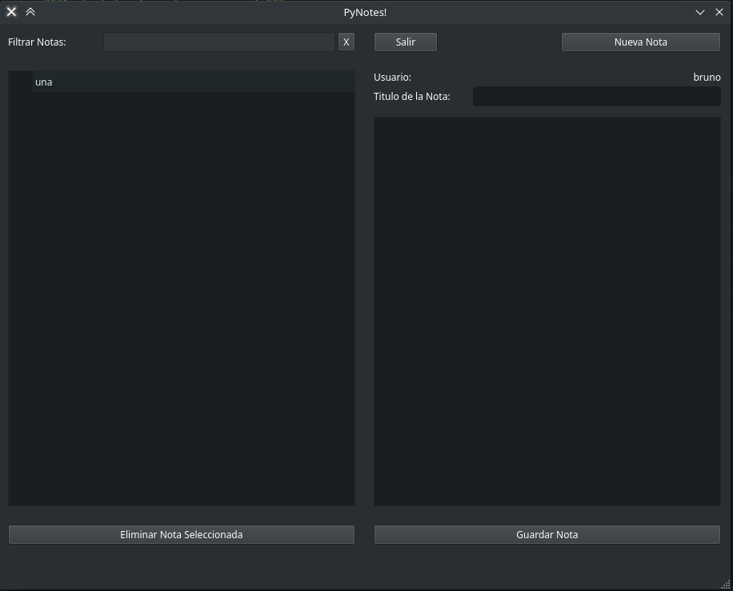

# PyNotes

Implementación de un block de notas para presentar en el curso de python dictado por la UTN FRBA.
Se utiliza como motor de ventanas PyQt5 y base de datos a SQLite3.

El block de notas funciona correctamente por si solo, pero tambien se incluye un server al cual se conecta  para informar sobre eventos de login o signup.
## Autores (Nivel Intermedio)
  - García, Bruno
  - Gómez, Ezequiel
  - Mazzucco, Francisco
  - Rodríguez, María Belén

## Autores (Nivel Avanzado)
  - García, Bruno

## Dependencias
La aplicación está desarrollada utilizando Python versión 3.9.13. Antes de ejecutar nada se debe tener instalado el interprete de python correspondiente. Se lo puede descargar de [python.org](https://www.python.org/downloads/).
Una vez instalado el interprete, para instalar las dependencias se debe ejecutar el comando:

    pip install -r requirements.txt

## Modo de uso
### Block de Notas
Para iniciar la aplicacion de notas se debe ejecutar el siguiente comando en una consola ubicada en el directorio raíz del proyecto:

    python notes.py

Iniciándola de esa forma, la aplicación intentará conectarse a un server (incluido en los fuentes) al host y puertos predeterminados. Estos valores son:
- HOST: 127.0.0.1
- PORT: 9999

Para iniciar la aplicación haciendo que se conecte al server usando otros datos, se le deben pasar dichos datos por linea de comando al iniciar:

    python notes.py 192.168.1.54 9876

Es obligatorio que si se pasa un parametro se pasen ambos.

### Server de registro
La aplicación se encuentra dentro de los fuentes del proyecto, en la carpeta `server`. Para iniciar el servidor se debe abrir una consola en dicha carpeta y ejecutar el comando:

    python logserver.py

Una vez iniciada la aplicación se provee un cuadro de entrada para cambiar el valor del puerto en el que se escuchará. Aceptado el valor, para iniciar propiamente el server se debe hacer click sobre el boton `Iniciar`.

## Funcionalidades pendientes
  - Agregar el acceso a una SQL via red para compartir notas.
  - Desarrollo de un ORM basado en descriptores.
  - Agregar manejo de algunas excepciones
  - Agregar la funcionalidad del filtrado de notas (existe el campo para filtrar, pero no tiene funcionalidad)
  - Chequear / Escapar caracteres especiales en los campos de texto para evitar SQL Inj.
