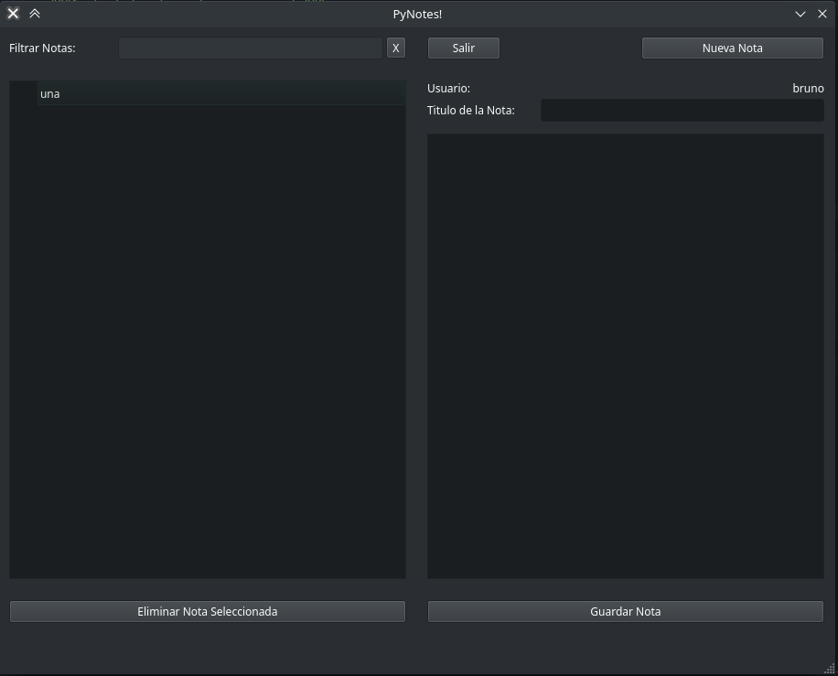

Introducción
============

Implementación de un block de notas para presentar en el curso de python dictado por la UTN FRBA. Se utiliza como motor de ventanas PyQt5 y base de datos a SQLite3.

Se incluye ademas una aplicacion servidro, la cual recibe actualizaciones desde el block de notas respecto de eventos tales como el registro de un nuevo usuario o el ingreso de un usuario.

El block de notas funciona correctamente por si solo, es decir, si la aplicacion server no esta en funcionamiento (por la razon que fuere), PyNotes sigue funcionando sin problema alguno.

Dependencias
------------

La aplicación está desarrollada utilizando **Python versión 3.9.13**. Antes de ejecutar nada se debe tener instalado el interprete de python correspondiente.
Se lo puede descargar de `python.org <https://www.python.org/downloads/>`_.
Una vez instalado el interprete, para instalar las dependencias se debe ejecutar el comando::

    pip install -r requirements.txt

Modo de uso
-----------

Block de Notas
^^^^^^^^^^^^^^

Para iniciar la aplicación de notas se debe ejecutar el siguiente comando en una consola ubicada en el directorio raíz del proyecto:::

    python notes.py

Iniciándola de esa forma, la aplicación intentará conectarse a un server (incluido en los fuentes) al host y puerto predeterminado.
Estos valores son:

* host: 127.0.0.1
* puerto: 9999

Para iniciar la aplicación haciendo que se conecte al server usando otro host y puerto, se le deben pasar dichos
datos por linea de comando al iniciarla::

    python notes.py 192.168.1.54 9876

**IMPORTANTE**: Es obligatorio que si se pasa un parametro se pasen ambos.

.. _uso_server:

Server de registro
^^^^^^^^^^^^^^^^^^

La aplicación se encuentra dentro de los fuentes del proyecto, en la carpeta `server`.
Para iniciar el servidor se debe abrir una consola en dicha carpeta y ejecutar el comando::

    python logserver.py

Una vez iniciada la aplicación se provee un cuadro de entrada para cambiar el valor del puerto en el
que se escuchará. Aceptado el valor, para iniciar propiamente el server, se debe hacer click sobre
el boton `Iniciar`.
