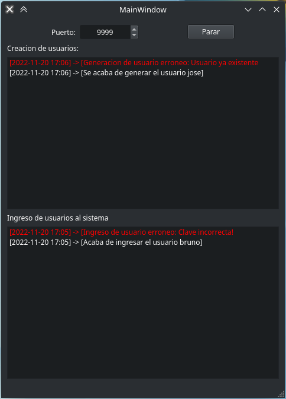

Servidor de Registro de Eventos de Usuario
------------------------------------------

Para finalizar, tambien se solicitaba implementar un servidor para generar un registro de log con la información que llega desde un cliente.

Para ésto se genero una nueva aplicacion QT en la que se van registrando los mensajes obtenidos mediante las actualizaciones del Publisher descripto en :ref:`observador`.

El código del server se encuentra dentro del mismo proyecto en la carpeta `server`. Para instrucciones de como utilizarlo ver la sección :ref:`uso_server`.

La implementación de las funcionalidades que involucran sockets se hicieron mediante `sockersever <https://docs.python.org/3.9/library/socketserver.html>`_.

Código del server
-----------------

.. literalinclude:: ../../server/lib/libsrv.py
    :pyobject: Server
    :caption: /server/lib/libsrv.py

Codigo del Handler para los Requests
------------------------------------

.. literalinclude:: ../../server/lib/libsrv.py
    :pyobject: RequestHandler
    :caption: /server/lib/libsrv.py

Codigo del Cliente
------------------

.. literalinclude:: ../../logger/pubsub.py
    :pyobject: LogSubscriber._send_message
    :caption: /logger/pubsub.py